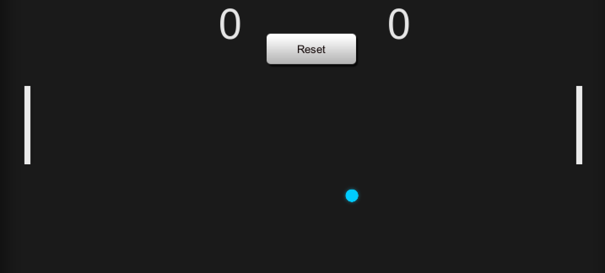
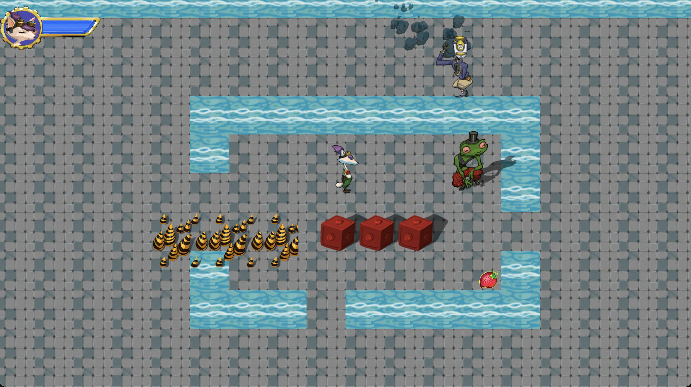

UnityTutorial

包含以下学习项目：

## **[Pong]()**

学习 Unity 基础操作，控制游戏角色，音乐以及碰撞事件等

教程地址: [《How to make a 2D Game - Promo》](https://www.youtube.com/watch?v=9h-z0AyG42k&list=PLPV2KyIb3jR4_IYZY2V0G3IUYcx1zZkJe)

运行画面:

## **[Platformer-2D]()**
学习 Unity 初级使用，学习角色控制器、世界设计与交互、控制摄像机等

 教程地址：[《Ruby's Adventure：2D 初学者》](https://learn.u3d.cn/tutorial/unity-ruby-adventure?chapterId=63562b27edca72001f21d0af#)

运行画面:

